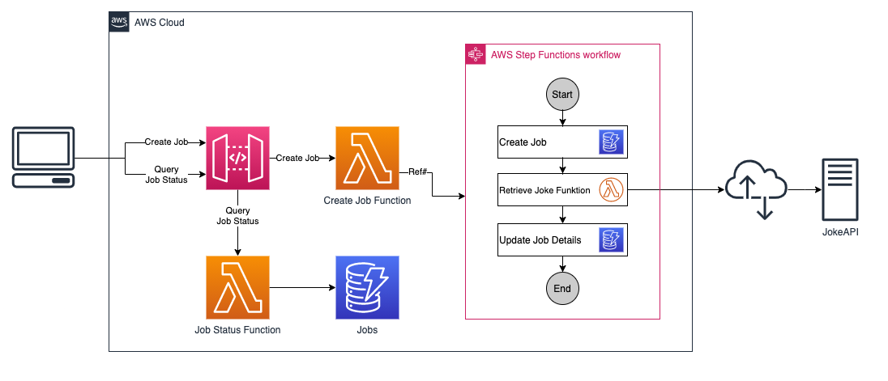
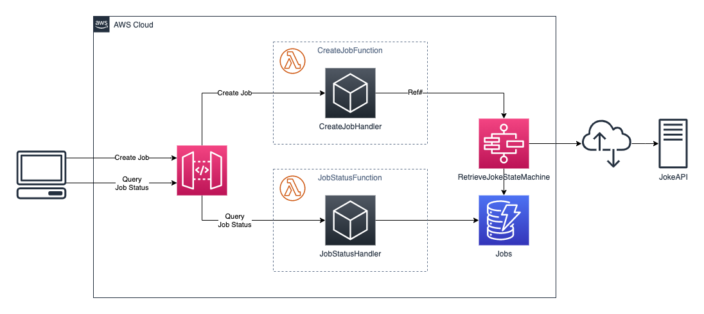
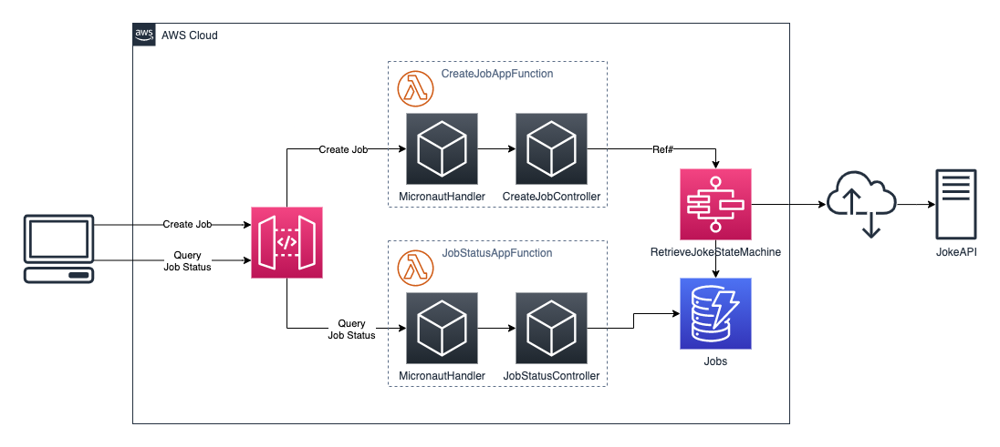
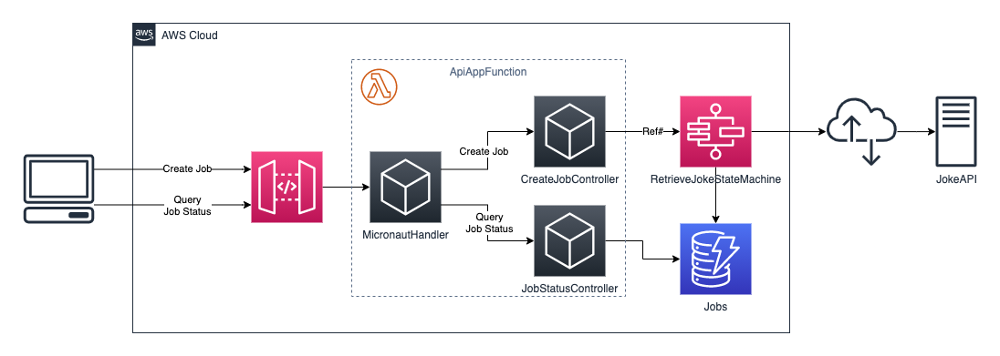

# Workbench for AWS Step Functions

This project demonstrates how to implement a serverless application using Java and the [Micronaut](https://micronaut.io)
Framework.

The following AWS technologies are used:
* [API Gateway](https://aws.amazon.com/api-gateway/) to provide calls into the application
* [Lambda](https://aws.amazon.com/lambda/) for 
* [Step Functions](https://aws.amazon.com/step-functions/) for building the business workflow
* [Serverless Application Model (SAM)](https://aws.amazon.com/serverless/sam/) for deployment 

The application uses a workflow to retrieve a joke from [JokeAPI](https://jokeapi.dev/) and store the result in a
[DynamoDB](https://aws.amazon.com/dynamodb/) table in anasynchronous way.

## Architecture

The application utilizes the following services:
* an API Gateway to handle incoming requests
* a Lambda function to create a new job and trigger the main workflow
* the main workflow implemented as a Step Functions statemachine responsible for tracking the job status and querying
the Joke API
* a Lambda function that actually talks to the Joke API to retrieve a new joke
* a Lambda function to query the status of a given job including the joke that has been retrieved
* a DynamoDB table persisting the state of a job and the retrieved joke



When using Micronaut as framework there are different ways to implement the application. The following sections outline
three different approaches.

### One Micronaut function per Lambda function

In this approach every lambda function has its own codebase and are implemented separately. The functions are
implemented as Micronaut function and thus only have a thin layer for handling incoming events. 



### One Micronaut app per Lambda function 



### One Micronaut app for all API calls



## Deploy the application

This project uses tha [AWS Servlerless Application Model](https://aws.amazon.com/serverless/sam/) to build and deploy the application.

To use the SAM CLI, you need the following tools.

* SAM CLI - [Install the SAM CLI](https://docs.aws.amazon.com/serverless-application-model/latest/developerguide/serverless-sam-cli-install.html)
* Node.js - [Install Node.js 10](https://nodejs.org/en/), including the NPM package management tool.
* Docker - [Install Docker community edition](https://hub.docker.com/search/?type=edition&offering=community)

To build and deploy your application for the first time, run the following in your shell:

```bash
sam build
sam deploy --guided
```

The first command will build the source of your application. The second command will package and deploy your application to AWS, with a series of prompts:

* **Stack Name**: The name of the stack to deploy to CloudFormation. This should be unique to your account and region, and a good starting point would be something matching your project name.
* **AWS Region**: The AWS region you want to deploy your app to.
* **Confirm changes before deploy**: If set to yes, any change sets will be shown to you before execution for manual review. If set to no, the AWS SAM CLI will automatically deploy application changes.
* **Allow SAM CLI IAM role creation**: Many AWS SAM templates, including this example, create AWS IAM roles required for the AWS Lambda function(s) included to access AWS services. By default, these are scoped down to minimum required permissions. To deploy an AWS CloudFormation stack which creates or modifies IAM roles, the `CAPABILITY_IAM` value for `capabilities` must be provided. If permission isn't provided through this prompt, to deploy this example you must explicitly pass `--capabilities CAPABILITY_IAM` to the `sam deploy` command.
* **Save arguments to samconfig.toml**: If set to yes, your choices will be saved to a configuration file inside the project, so that in the future you can just re-run `sam deploy` without parameters to deploy changes to your application.

You can find your API Gateway Endpoint URL in the output values displayed after deployment.

## Use the SAM CLI to build and test locally

Build the Lambda functions in your application with the `sam build --use-container` command.

```bash
workbench-step-functions$ sam build
```

The SAM CLI installs dependencies defined in `functions/*/package.json`, creates a deployment package, and saves it in the `.aws-sam/build` folder.

## Fetch, tail, and filter Lambda function logs

To simplify troubleshooting, SAM CLI has a command called `sam logs`. `sam logs` lets you fetch logs generated by your deployed Lambda function from the command line. In addition to printing the logs on the terminal, this command has several nifty features to help you quickly find the bug.

```bash
workbench-step-functions$ sam logs -n StockCheckerFunction --stack-name workbench-step-functions --tail
```

You can find more information and examples about filtering Lambda function logs in the [SAM CLI Documentation](https://docs.aws.amazon.com/serverless-application-model/latest/developerguide/serverless-sam-cli-logging.html).

## Unit tests

Tests are defined in the `functions/*/tests` folder in this project. Use NPM to install the [Mocha test framework](https://mochajs.org/) and run unit tests.

```bash
workbench-step-functions$ cd functions/stock-checker
stock-checker$ npm install
stock-checker$ npm run test
```

## Cleanup

To delete the sample application that you created, use the AWS CLI. Assuming you used your project name for the stack name, you can run the following:

```bash
aws cloudformation delete-stack --stack-name workbench-step-functions
```

## Resources

* [JokeAPI](https://jokeapi.dev/)
* [DynamoDB](https://aws.amazon.com/dynamodb/)

