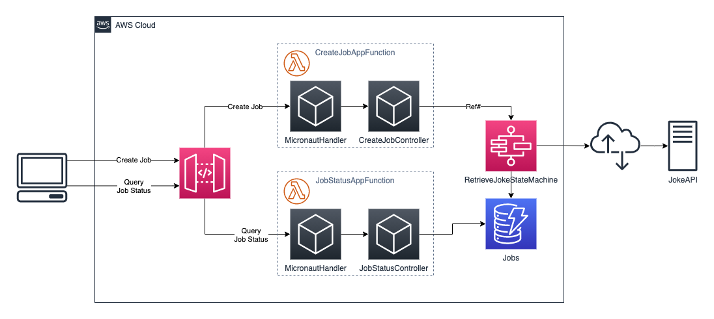
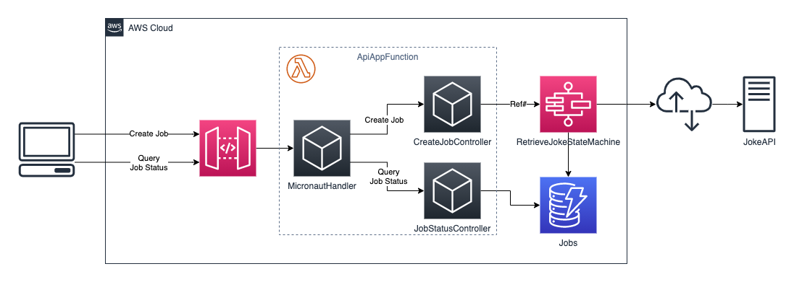

# Architecture

[Micronaut](https://micronaut.io) offers multiple event handler that improve productivity in different scenarios.
When using Micronaut as framework there are different ways to implement this application.

## One Micronaut function per Lambda function

In this approach every lambda function has its own codebase and are implemented separately. The functions are
implemented as Micronaut function and thus only have a thin layer for handling incoming events.

## One Micronaut app per Lambda function

When implementing a Lambda functions that is invoked by an [API Gateway](https://aws.amazon.com/api-gateway/) the
`MicronautLambdaHandler` can be used to implement an application that abstracts from the handler model that is used
by the functional approach. In this case the application uses request handlers that are also used by applications
using an HTTP server or Servlet container.

This project contains a two Micronaut application that are implemented using the `MicronautLambdaHandler` for creating
a job and querying its status.

## One Micronaut app for all API calls

This approach differs from the previous one by combining both functions (the whole API) in one application. The whole
application is deployed as one 'function' processing different requests from the API gateway. This means that each
'function' instance is able to respond to every API call and thus reduces the number of cold starts. It's also easier
to share application logic if this is a requirement. On the other hand the application requires more memory during
execution.

